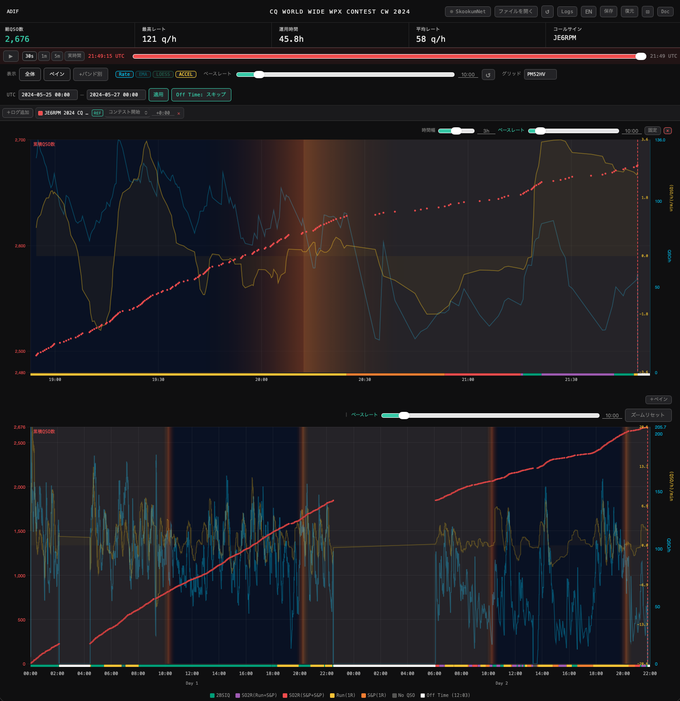

# BICHOK

[English README](README.md)

BICHOK は、アマチュア無線コンテストのログをブラウザで可視化・分析するツール。累積
QSO 数とレート、そのトレンド、バンド別の内訳、そしてログから復元した運用形態
（Run / S&P / SO2R / 2BSIQ）を一枚のグラフに描く。複数のログを同じ時間軸に重ねて
比較することもでき、macOS では SkookumLogger からログ中のコンテストをそのまま
リアルタイムで追える。

名称は Butt In Chair, Hands On Keyboard の略。読みはビックホック(bikhɔ́k)。



## 特徴

- Cabrillo / ADIF に対応。累積 QSO 数とレートを一枚のグラフに表示
- レートのトレンド表示（Rate / EMA / LOESS / ACCEL）。それぞれ個別にオン・オフ可能
- バンド別グラフ
- 運用モードカラー — Run(1R) / S&P(1R) / SO2R / 2BSIQ / No QSO / Off Time を
  ログから判定して帯で表示
- ベースレート — 目標ペースとの比較
- Off Time スキップ。WPX・WAE では自動判定
- 複数ログを同じ時間軸に重ねて比較。コンテスト開始または first QSO を基準に整列し、
  ログごとのオフセット指定も可能
- ペインビュー — 直近 N 時間を拡大表示するローリングウィンドウ。複数配置可、固定／追随
- シミュレーション再生 — 終了したログをライブのように再生
- SkookumNet 経由での SkookumLogger からのライブ受信（macOS）
- グリッドロケーターからの日照表示と日の出・日の入り線
- セッションのブラウザ保存・復元、日英表示切替
- スマートフォンでも縦横どちらの向きでも利用可能

## 必要環境

- モダンブラウザ（Chrome / Chromium、Safari、Firefox、Edge）
- 他には何も要らない。ページはファイルのまま動作するので、サーバー・Python・
  インストール作業はいずれも不要
- ライブ受信を使う場合のみ: macOS、SkookumLogger、そして
  [uv](https://docs.astral.sh/uv/)（未導入ならランチャーがインストールコマンドを表示）

| 環境 | ログファイルの分析 | SkookumNet ライブ接続 |
|---|---|---|
| macOS | ○ | ○ |
| Windows | ○ | −（ボタンが表示されない） |
| Linux | ○ | −（ボタンが表示されない） |
| WSL2 | ○ | −（ボタンが表示されない） |

ライブ接続が使えない環境では、そのボタンが表示されないだけで他の機能はすべて動作する。
どのロガーで書き出したログでも、ファイルとして読み込む分には支障がない。

## クイックスタート

1. [最新リリース](https://github.com/kondou/bichok/releases/latest)から zip を
   ダウンロード（またはこのリポジトリを clone）し、好きな場所に展開する。フォルダ名は
   問わない。`contest_log_analyzer.html` と `chart.min.js` は同じフォルダに置くこと
2. ページを開く:
   - **Windows** — `contest_log_analyzer.html` をダブルクリックする。ブラウザで開かない
     場合は `start_bichok.bat` を使う
   - **macOS** — `contest_log_analyzer.html` をダブルクリックする。SkookumNet ブリッジも
     起動したい場合は `start_skookumnet.command`（初回のみ右クリック →「開く」）
   - **Linux** — ページをブラウザで開く。または `bash start_bichok.sh`
   - **WSL2** — WSL2 のターミナルから `bash start_bichok.sh` を実行すると Windows 側の
     ブラウザにページが渡される。`wslu`（`sudo apt install wslu`）を入れておくと
     ブラウザが自動で開く
3. Cabrillo / ADIF ファイルをウィンドウにドラッグ＆ドロップする（**ファイルを開く**
   ボタンでもよい）

> **Windows で「発行元を確認できませんでした」と出る場合:** そのまま「実行」を
> クリックすれば起動する。毎回出るのを止めたい場合は、展開したフォルダで PowerShell を
> 開いて以下を実行する:
> ```powershell
> Get-ChildItem -Recurse | Unblock-File
> ```

BICHOK はインターネット接続を必要とせず、ログを外部へ送信することもない。
ネットワークを使うのは、同じマシン上で動く SkookumNet ブリッジへの WebSocket のみ。

## ドキュメント

- [ユーザーガイド（日本語）](docs/contest_log_analyzer_ja.md)
- [User guide (English)](docs/contest_log_analyzer_en.md)

いずれもリリース zip に、単体で完結する HTML
（`contest_log_analyzer_ja.html` / `contest_log_analyzer_en.html`）として同梱されており、
オフラインでも読める。

SkookumNet ブリッジについては[専用の README](bridge/README.md) に、話すプロトコルと
コマンドラインオプションを記載している。

## ライセンス

[MIT](LICENSE)。ブリッジも独立して MIT で、他の SkookumNet クライアントのコードを
一切含まない。
