# BICHOK — User Guide

A browser-based tool for visualizing and analyzing contest logs (Cabrillo / ADIF).
Real-time integration with SkookumLogger via SkookumNet is also supported.
Pronounced *bikhɔ́k* — **B**utt **I**n **C**hair, **H**ands **O**n **K**eyboard.

---

## Table of Contents

1. [Glossary](#1-glossary)
2. [Getting Started](#2-getting-started)
3. [Loading a Log](#3-loading-a-log)
4. [Interface Overview](#4-interface-overview)
5. [Stats Bar](#5-stats-bar)
6. [Display Mode](#6-display-mode)
7. [Main Chart](#7-main-chart)
8. [Band Breakdown Chart](#8-band-breakdown-chart)
9. [Mode Bar Colors](#9-mode-bar-colors)
10. [Trend Overlays (Rate / EMA / LOESS / ACCEL)](#10-trend-overlays-rate--ema--loess--accel)
11. [Base Rate](#11-base-rate)
12. [UTC Range and Contest Start/End](#12-utc-range-and-contest-startend)
13. [Off Time Skip](#13-off-time-skip)
14. [Simulation Playback](#14-simulation-playback)
15. [Loading Multiple Logs](#15-loading-multiple-logs)
16. [Pane View (Rolling Window)](#16-pane-view-rolling-window)
17. [SkookumNet Live Connection](#17-skookumnet-live-connection)
18. [Save / Restore Session](#18-save--restore-session)
19. [Grid Locator](#19-grid-locator)
20. [Language](#20-language)
21. [Zoom and Pan](#21-zoom-and-pan)
22. [Troubleshooting](#22-troubleshooting)
23. [Using on a Smartphone](#23-using-on-a-smartphone)

---

## 1. Glossary {#1-glossary}

Technical terms used throughout this document. Refer back here as needed.

### Operating Modes

| Term | Description |
|------|-------------|
| **Run / CQ** | Calling CQ and working stations that call you. Shown as "Run" in the chart legend. |
| **S&P (Search & Pounce)** | Hunting across the band for stations to call. Shown as "S&P" in the chart legend. |
| **1R (1 Radio)** | Operating with a single radio. |
| **SO2R (Single Operator 2 Radio)** | One operator running two radios simultaneously. |
| **2BSIQ (Two Bands Synchronized Interleaved QSOs)** | An SO2R technique: running simultaneously on two bands in a synchronized, interleaved fashion. |

> **How Run/S&P is detected**
>
> For Cabrillo and ADIF logs, the tool infers Run vs. S&P on a per-band basis from the frequency change between consecutive QSOs on the same band.
>
> **Detection rules (applied per band):**
>
> 1. Compute the frequency change between consecutive QSOs on the same band.
> 2. If two or more jumps of ≥ 0.5 kHz occur within 30 minutes → **classified as S&P**.
> 3. Starting from confirmed S&P QSOs, adjacent QSOs with similarly large frequency excursions are also classified as S&P (a gap of more than 30 minutes resets the boundary).
> 4. All QSOs not classified as S&P are treated as **Run**.
>
> **Rationale:** A running station stays on one frequency calling CQ, so frequency movement is minimal. An S&P operator hunts across the band, so frequency excursions are large.
>
> **Cases where detection may be inaccurate:** A station that QSYs while running, an S&P operator with very small frequency steps, or a Cabrillo log with frequencies recorded only to kHz granularity may be misclassified. Multi-op logs are especially prone to inaccuracy since multiple radios may be active.
>
> **No frequency data in the log:** If rig control was disconnected or out of sync during logging, the logged frequency may be fixed or recorded with the lower three kHz digits as 000. In that case all inter-QSO frequency differences compute to 0 and every QSO is classified as Run. If the mode bar display looks wrong, check the frequencies in your log file.
>
> ADIF files and SkookumNet live data provide higher-resolution timestamps (ADIF: seconds; SkookumNet: milliseconds) and frequencies (Hz precision) compared to Cabrillo (minute resolution), so the same algorithm yields more accurate results.

### Log Formats

| Term | Description |
|------|-------------|
| **Cabrillo** | The standard contest log format. Extensions: `.log` `.cbr` `.txt` `.cabrillo` |
| **ADIF (Amateur Data Interchange Format)** | A widely used log format, not limited to contests. QSO times are recorded to the second and frequencies to Hz (vs. minute/kHz granularity in Cabrillo), enabling more detailed analysis. Extensions: `.adi` `.adif` |

### Rate and Timing

| Term | Description |
|------|-------------|
| **QSO/h rate** | QSOs per hour — a primary measure of contest operating pace. Because Cabrillo logs record QSO times only to the minute, when multiple QSOs share the same timestamp, their exact position within that minute is unknown. This tool assumes QSOs within the same minute are evenly distributed across that 60-second window and uses the interpolated timestamps for rate calculations. |
| **Base rate** | The time window used to compute the displayed rate. Example: with a 10-minute base rate, rate = QSOs in the last 10 minutes × 6. |
| **No QSO** | A gap of 10 minutes or more with no QSOs. Shown as gray in the mode bar and labeled "No QSO" in the legend. Typically indicates a temporary pause such as a band change or equipment adjustment. In WPX and WAE contests, gaps under 60 minutes are No QSO; gaps of 60 minutes or more become Off Time. In all other contests, all gaps are treated as No QSO regardless of length. |
| **Off Time** | A mandatory rest period required in the Single Operator category of WPX and WAE contests: any continuous no-QSO gap of 60 minutes or more. Shown as white in the mode bar. Can be excluded from rate calculations — see [Off Time Skip](#13-off-time-skip). |

### Trend Curves

| Term | Description |
|------|-------------|
| **Rate** | The QSO/h rate value at each point. Shows instantaneous QSO density but swings widely due to QSO spacing variability — not well suited for reading trends. |
| **EMA (Exponential Moving Average)** | A smoothed curve that reduces Rate noise while remaining sensitive to recent changes (units: QSO/h). Good for tracking in real time whether your rate is trending up or down. Formula: `new EMA = α × current QSO/h rate + (1−α) × previous EMA` (α = 2 ÷ (base rate [min] + 1)) |
| **LOESS (Locally Estimated Scatterplot Smoothing / Local Regression)** | A very smooth trend curve for viewing the contest as a whole (units: QSO/h). Reacts more slowly than EMA, but ideal for identifying peak hours, overnight lulls, and other macro operating patterns. Causal implementation — no lookahead. Computed by locally weighted linear regression over past Rate values, giving higher weight to nearby points and lower weight to distant ones. |
| **ACCEL (Acceleration)** | The rate of change of EMA (units: (QSO/h)/min). Because Rate fluctuates too much to differentiate directly, the smoothed EMA is used instead. Leads Rate and EMA, providing early warning of band openings and closings. Positive = rate rising; negative = rate falling. |

### Multi-Log Comparison

| Term | Description |
|------|-------------|
| **Reference log (REF)** | The log that defines the X axis (time axis) when comparing multiple logs. |
| **Contest start anchor** | The reference point used to align times across logs: "Contest Start" (the contest start time entered in the UTC field) or "First QSO" (each log's own first QSO time). |
| **Offset** | An intentional time shift applied to a log. `+1:30` shifts the log 1 hour 30 minutes later on the time axis. |

### SkookumLogger / SkookumNet

| Term | Description |
|------|-------------|
| **SkookumLogger** | A contest logging application for macOS. |
| **SkookumNet** | The protocol used by SkookumLogger to share QSO data in real time between multiple instances (multi-PC operation). |
| **skookumnet-client** | A Python script that receives SkookumNet packets and relays them to this tool (the browser) via WebSocket. |

### Other

| Term | Description |
|------|-------------|
| **Grid locator** | A position code in the Maidenhead Locator System (e.g., `PM95`, `PM52HV`). Used to calculate sunrise and sunset times. |
| **localStorage** | A browser mechanism for storing data on the local device. Data persists after tabs and windows are closed. The storage location is browser-dependent. |
| **Mode bar** | The thin color-coded strip along the bottom of the main chart and panes. Each color segment represents the detected operating mode (Run, S&P, SO2R, No QSO, Off Time) at that point in time. Color transitions mark changes in operating mode. → [Mode Bar Colors](#9-mode-bar-colors) |
| **Pane** | A rolling-window sub-chart that displays the most recent N hours of QSOs at an expanded scale. Multiple panes can be shown simultaneously. |

---

## 2. Getting Started {#2-getting-started}

Open `contest_log_analyzer.html` in a browser — no internet connection, installation, or server required. (SkookumNet live connection requires being on the same Layer-2 network as SkookumLogger.)

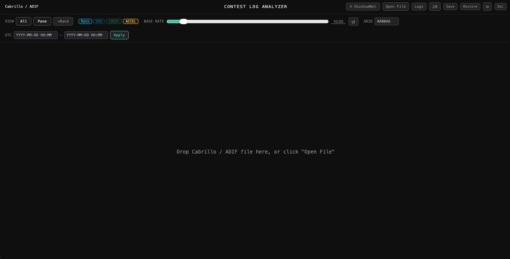

### Tested browsers
- Google Chrome / Chromium
- Safari
- Firefox
- Edge

### File layout

**Log file analysis only (no SkookumNet)**
```
contest_log_analyzer.html    ← open this in your browser
chart.min.js                 ← must be in the same folder (charting library)
contest_log_analyzer_ja.html ← documentation (Japanese)
contest_log_analyzer_en.html ← documentation (English)
```

**With SkookumNet live connection (macOS only)**
```
contest_log_analyzer.html
chart.min.js
skookumnet_client.py        ← SkookumNet ↔ browser relay script
start_skookumnet.command    ← double-click launcher
plugins/                    ← plug-ins used by skookumnet_client.py
```

For detailed SkookumNet startup instructions → [§17 SkookumNet Live Connection](#17-skookumnet-live-connection)

---

## 3. Loading a Log {#3-loading-a-log}

Load a log using any of the methods below, or connect via SkookumNet live (→ [connection instructions](#17-skookumnet-live-connection)).

### Drag and drop
Drag a log file onto the browser window.

### Open File button
Click the **Open File** button (top right) and select a file.

### Supported formats

| Format | Extensions |
|--------|-----------|
| Cabrillo | `.log` `.cbr` `.txt` `.cabrillo` |
| ADIF | `.adi` `.adif` |

### Loading a second (or additional) log
When a log is already loaded and you open another file, a confirmation dialog appears.

| Choice | Action |
|--------|--------|
| **OK** | Add as a comparison log (→ [Loading Multiple Logs](#15-loading-multiple-logs)) |
| **Cancel** | Replace the current log with the new file |

### What is displayed after loading

If the Cabrillo or ADIF file contains a contest name, it is automatically shown in the header after loading. The same applies when receiving data via SkookumNet.

### ↺ button (reload)
The **↺** button (top right) reloads the last opened file — useful after editing and saving the file externally.

---

## 4. Interface Overview {#4-interface-overview}

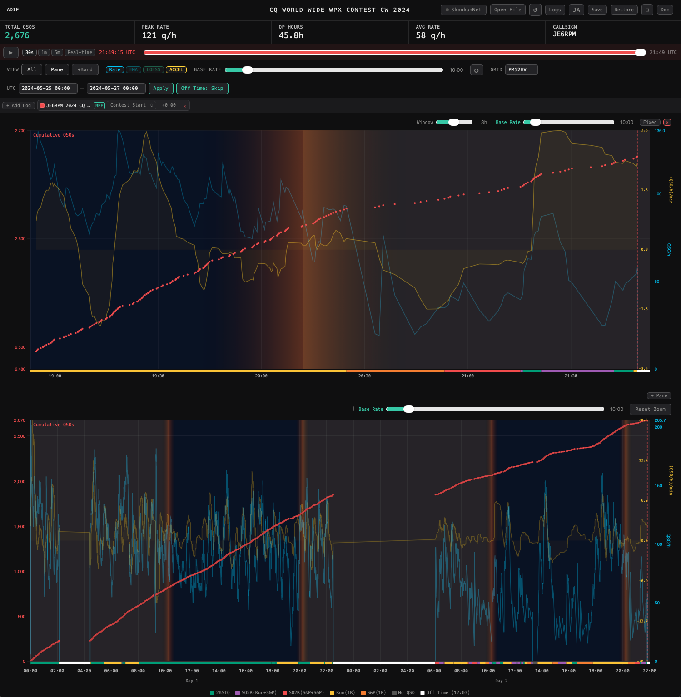

The screen is laid out top to bottom as follows.

| Area | Description |
|------|-------------|
| Header | Open File, ↺, Logs, language toggle, Save/Restore, ⊡ (compact), Doc, and other buttons; contest name and file format (shown after loading) |
| Stats bar | Total QSOs, peak rate, operating time, average rate, callsign (shown after loading) |
| Simulation bar | Play/pause, speed, scrub slider (shown after loading) |
| Control bar | Display mode toggles, trend toggles, base rate, grid locator, UTC range, log management panel |
| Pane | Rolling-window sub-chart added when **Pane** is on |
| Main chart | Cumulative QSOs (left axis) and rate (right axis) over time; mode bar along the bottom |
| Band breakdown chart | Shown below the main chart when **+Bands** is on; also shown below the pane when the pane is visible |

---

## 5. Stats Bar {#5-stats-bar}

After loading a log, key statistics appear near the top of the screen.

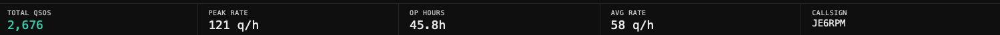

| Field | Content |
|-------|---------|
| Total QSOs | Total number of QSOs in the log |
| Peak rate | Highest QSO/h achieved (depends on the [base rate](#11-base-rate) setting) |
| Operating time | Time elapsed between first and last QSO |
| Average rate | Total QSOs ÷ operating time |
| Callsign | Station callsign read from the log |

### Compact mode

Click the **⊡** button (top right) to hide the stats bar, simulation bar, and log panel, giving more vertical space to the charts. Useful when screen height is limited or when you want a larger chart display during a live session. Click again to restore the normal view.

### Doc button

Click the **Doc** button (top right) to open this manual in a new tab. The manual opens in the language currently selected (Japanese or English).

---

## 6. Display Mode {#6-display-mode}

Select the active view using the **View** group at the left end of the control bar.

| Button | Action |
|--------|--------|
| **All** | Show the cumulative QSO main chart |
| **Pane** | Add a rolling-window pane view |
| **+Bands** | Add the per-band QSO breakdown chart (below pane and main chart) |

> **All and Pane can be used together:** the pane appears above, the main chart below.

---

## 7. Main Chart {#7-main-chart}

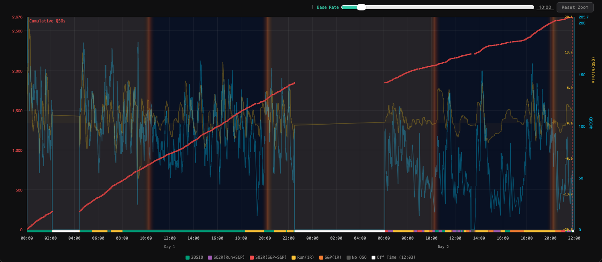

The chart overlays several data series.

| Element | Axis | Color | Content |
|---------|------|-------|---------|
| Cumulative QSOs | Left (red) | Red | Running total of QSOs since log start. Rendered as individual dots (one per QSO) rather than a continuous line, so QSO density is visible at a glance. |
| Rate and other trends (except ACCEL) | Right (light blue) | Light blue and trend-specific colors | QSO/h computed using the [base rate](#11-base-rate) setting |
| ACCEL | Right (yellow, separate scale) | Yellow | Rate-of-change of EMA, in (QSO/h)/min |
| Mode bar | Bottom of chart | Various | Operating mode at each point in time (→ [Mode Bar Colors](#9-mode-bar-colors)) |

### Chart markers

- **Sunrise / sunset (yellow and orange vertical lines):** Shown when a grid locator is configured. → [Grid Locator](#19-grid-locator)
- **Red dashed line:** Current-time marker in the pane or main chart.

### Tooltip

Hovering over the main chart pops up a tooltip showing the following values at the cursor's time position.

| Field | Content |
|-------|---------|
| HH:MM:SS UTC | UTC time at the cursor position |
| Cumulative N QSO | Cumulative QSOs up to that point |
| Rate: N.N | QSO/h rate at that point |
| EMA: N.N | EMA value (shown when EMA is on) |
| LOESS: N.N | LOESS value (shown when LOESS is on) |
| ACCEL: N.NN | ACCEL value (shown when ACCEL is on) |

When comparing multiple logs, each log's values are shown on separate lines labeled with the log name.

---

## 8. Band Breakdown Chart {#8-band-breakdown-chart}

Turn on **+Bands** to display a stacked bar chart below the main chart (and below the pane, if visible). When the band breakdown chart is shown, time slot buttons appear at the very bottom of the screen. Click any button to change the slot width.

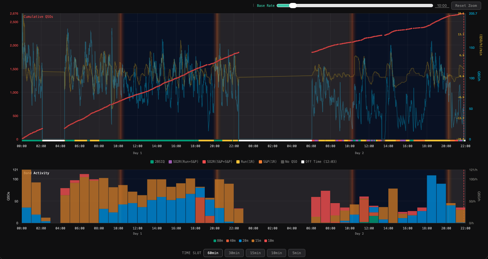

### What is shown

Each bar shows the rate (QSO/h) per band for that slot — note that bar height reflects rate, not raw QSO count per slot. When the slot width is 60 minutes, the rate value equals the QSO count for that hour.

### Band colors and legend

The legend below the chart lists band names and their corresponding colors. Only bands that actually appear in the log are included. When comparing multiple logs, every band present in any log is included in the legend.

In multi-log mode, each slot's bar is split between the reference log (REF) and additional logs, displayed side by side (→ [Loading Multiple Logs](#15-loading-multiple-logs)). **Additional log bars are rendered darker and slightly more transparent** than the reference log bars, making it easy to distinguish the same band across different logs visually.

### Tooltip

Hovering over the band breakdown chart pops up a tooltip with details for that slot.

| Field | Content |
|-------|---------|
| HH:MM–HH:MM UTC | Slot start and end time |
| Band: N QSO / N/h | QSO count and rate per band (with a colored dot) |
| Total: N QSO / N/h | Combined total for the slot |

When comparing multiple logs, the log name is shown before the slot time.

### Band breakdown in a pane

When the pane is visible, enabling **+Bands** also adds a band breakdown chart below the pane.

---

## 9. Mode Bar Colors {#9-mode-bar-colors}

The **mode bar** is the thin color-coded strip along the bottom of the main chart and panes. It shows the detected operating mode at each point in time. The bar is linked to the time axis; color transitions mark changes in operating mode. The legend below the chart shows labels for each mode, and — in WPX and WAE contests — the total accumulated Off Time.

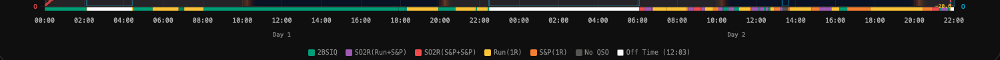

| Color | Label | Meaning |
|-------|-------|---------|
| Green | Run(1R) | Single-radio Run: calling CQ on one rig |
| Orange | S&P(1R) | Single-radio S&P: hunting stations on one rig |
| Yellow-green | 2BSIQ | SO2R running simultaneously on two bands (2BSIQ) |
| Purple | SO2R(Run+S&P) | SO2R with one radio running, the other doing S&P |
| Red | SO2R(S&P+S&P) | SO2R with both radios doing S&P |
| Gray | No QSO | No-QSO gap of 10 minutes or more |
| White | Off Time | No-QSO gap of 60 minutes or more; WPX and WAE only |

> In contests other than WPX and WAE, gaps of 60 minutes or more are also shown as "No QSO" — Off Time detection does not apply.

---

## 10. Trend Overlays (Rate / EMA / LOESS / ACCEL) {#10-trend-overlays-rate--ema--loess--accel}

Trend curves overlaid on the main chart. Click each button to toggle it on or off.

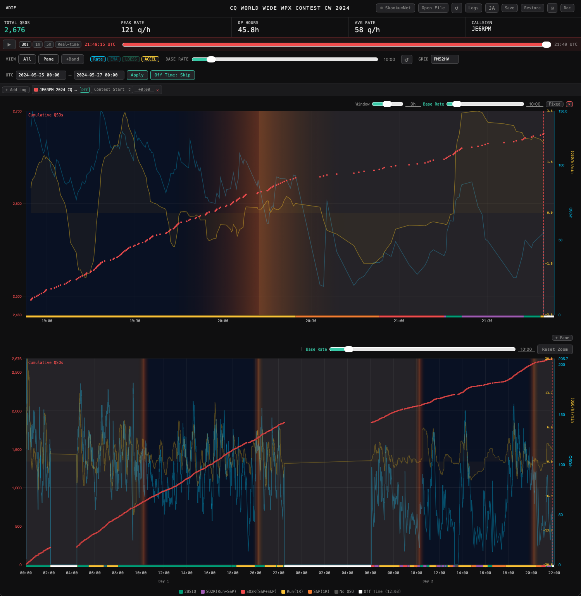

| Button | Color | Use |
|--------|-------|-----|
| **Rate** | Light blue | Raw QSO/h rate over the [base rate](#11-base-rate) window |
| **EMA** | Cyan | Short-term trend with Rate noise removed |
| **LOESS** | Green | Macro rate trend for the full contest |
| **ACCEL** | Yellow | Rate-of-change of EMA; tends to lead Rate and EMA |

### When comparing multiple logs

Each log is automatically assigned a distinct color. The reference log (REF) trend line uses a blue-green color family.

---

## 11. Base Rate {#11-base-rate}

The QSO/h rate is computed over a sliding time window called the base rate.

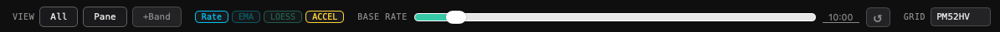

Use the **Base rate** input field to change the aggregation window.

- Range: 1 second to 120 minutes
- Format: `MM:SS` (e.g., `10:00` = 10 minutes, `0:30` = 30 seconds)
- The **↺** button resets to 10 minutes (default)

> **Example:** With a 10-minute base rate, the rate at any point = QSOs in the preceding 10 minutes × 6.

Each pane can also have its own independent base rate setting (→ [Pane View](#16-pane-view-rolling-window)).

---

## 12. UTC Range and Contest Start/End {#12-utc-range-and-contest-startend}

Use the **UTC** fields on the right side of the control bar to manually set the contest start and end times.


```
Format: YYYY-MM-DD HH:MM  (e.g., 2024-05-25 00:00)
```

| Action | Effect |
|--------|--------|
| Enter times and click **Apply** | Restricts the chart view to the specified interval; Off Time boundary detection also follows the UTC range |
| **✕** button | Clears the range restriction |

### Anchor and offset for multi-log comparison

In the log management panel (→ [Loading Multiple Logs](#15-loading-multiple-logs)), each log's time reference point (contest start anchor) and offset can be configured independently.

| Anchor | Reference point |
|--------|----------------|
| Contest Start | Aligns the log to the UTC start time entered in the UTC field |
| First QSO | Aligns the log to that log's own first QSO time |

---

## 13. Off Time Skip {#13-off-time-skip}

When Off Time is detected in a WPX or WAE contest log, an **Off Time** toggle button appears in the control bar.

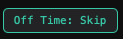
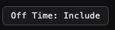

The button label indicates the current state.

| Button label | State | Effect |
|-------------|-------|--------|
| **Off Time: Skip** (accent color) | ON (skipping) | Off Time intervals are excluded from rate calculations; rate is computed over actual operating time only |
| **Off Time: Include** | OFF (not skipping) | Off Time is included in rate calculations |

Click the button to toggle.

> The "Off Time (HH:MM)" shown in the legend always reflects the total accumulated Off Time, regardless of whether Skip is on or off.

---

## 14. Simulation Playback {#14-simulation-playback}

After loading a log, a **simulation bar** appears below the stats bar. It replays the log along the time axis — showing how cumulative QSOs, rate, and operating mode would have appeared as the contest unfolded in real time. The band breakdown chart, if visible, is also animated. The simulation bar is hidden when a SkookumNet live connection is active.

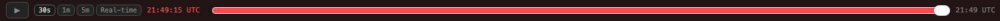

| Control | Function |
|---------|----------|
| ▶ / ❚❚ | Play / pause |
| Scrub slider | Jump to any point in the log |
| **30s / 1m / 5m** | Replay the entire log in 30 wall-clock seconds, 1 minute, or 5 minutes (fast forward) |
| **Real time** | Replay at actual elapsed time |

The main chart and pane update in real time as playback progresses.

---

## 15. Loading Multiple Logs {#15-loading-multiple-logs}

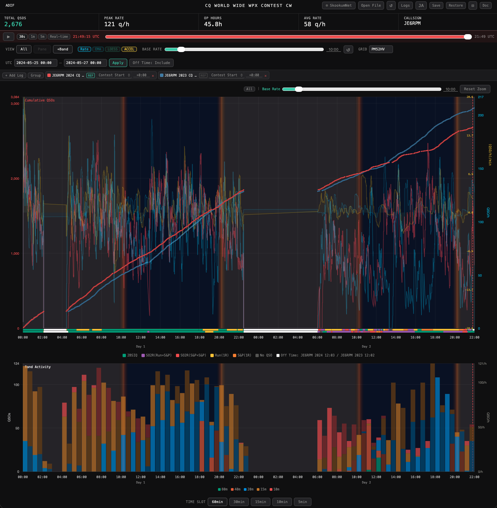

### Adding logs

1. Click **Logs** to open the log management panel.
2. Click **+ Add log** and select a file.
3. Or drag and drop a file onto the window and choose "OK (Add)".

### Log management panel

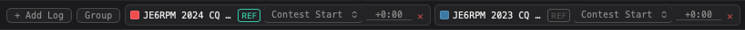

| Control | Function |
|---------|----------|
| Color swatch (■) click | Toggle that log's visibility |
| Double-click label | Edit the log name |
| **REF** button | Set this log as the X-axis (time axis) reference |
| Anchor selector | Choose Contest Start or First QSO |
| Offset field | Enter a time offset (e.g., `+1:30` = shift 1 hour 30 minutes later) |
| **✕** button | Remove all data for this log from the chart |

### Grouping

With two or more logs loaded, clicking **Group** creates a merged log that combines all QSOs.

- The merged log can be displayed like any regular log.
- Click **Ungroup** to dissolve the group (original logs remain intact).
- Useful when receiving data from multiple stations over SkookumNet (e.g., SO2R) to view a combined QSO total.

### Filtering the main chart

Click the **All** button in the top right of the main chart to open a dropdown for choosing which logs are displayed.

---

## 16. Pane View (Rolling Window) {#16-pane-view-rolling-window}

Click the **Pane** button to add a rolling-window pane showing the most recent N hours of QSOs at an expanded scale. Particularly useful for real-time monitoring during a SkookumNet live session.

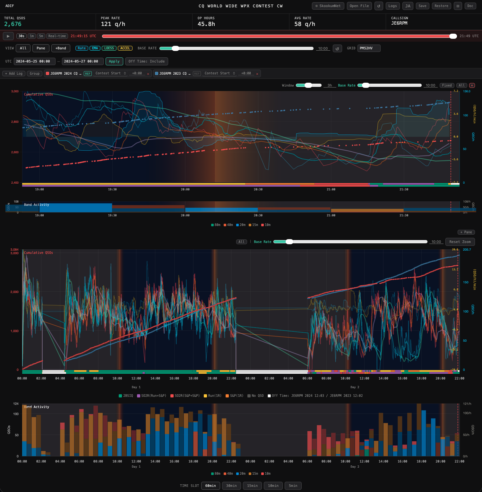

### Pane controls

| Control | Function |
|---------|----------|
| **Window** slider | Change the displayed time span (5 minutes to 6 hours) |
| **Base rate** input | Set the pane's own rate aggregation window (changing the main chart base rate also overwrites the pane's value; to keep a pane-specific value, re-enter it after changing the main chart base rate) |
| **Fixed / Follow** button | Switch display mode (→ [Fixed mode and Follow mode](#fixed-mode-and-follow-mode)) |
| **+ Pane** button | Add another pane (multiple panes can be shown simultaneously) |
| **✕** button | Close this pane |
| **All** button | Select which logs / stations to show in this pane |
| **Reset zoom** button | Clear any zoom applied to this pane |

### Fixed mode and Follow mode

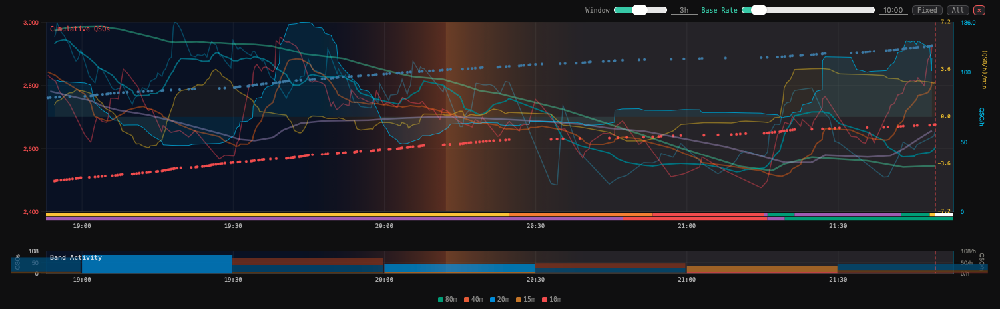

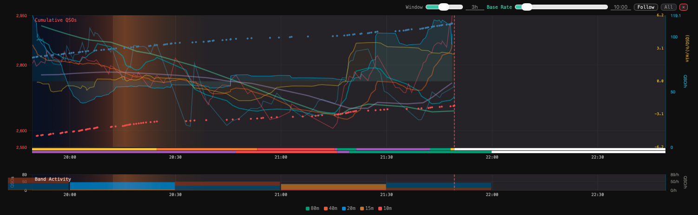

| Mode | Behavior |
|------|----------|
| **Fixed** | The red dashed line (current-time marker) stays fixed on the chart; the chart itself scrolls right to left as time advances. |
| **Follow** | The chart position is fixed. The red dashed line moves left to right as time advances. When the line reaches 2% from the right edge, the chart shifts left and the line is repositioned at one-third from the right edge. |

### Zooming and panning the pane

Drag within the chart area to select a range and zoom in. Drag along the time labels at the bottom of the chart to pan. There is no incremental zoom-out — the **Reset zoom** button returns to the original scale in one step.

### Multiple panes

Use **+ Pane** to display several panes at once — for example, one showing all stations combined and another showing a single station (→ [Multi-station (multi-op)](#multi-station-multi-op)).

---

## 17. SkookumNet Live Connection {#17-skookumnet-live-connection}

Receive and display SkookumLogger's SkookumNet packets in real time.

### Prerequisites

- skookumnet-client must be running on macOS.
- SkookumLogger must be running.

> **SkookumNet button:** The button is not shown on non-macOS systems. On macOS it is always shown; if skookumnet-client is not running when you attempt to connect, a connection error will be reported.

```bash
# Launch skookumnet-client (or double-click start_skookumnet.command)
uv run python skookumnet_client.py
```

### Connecting

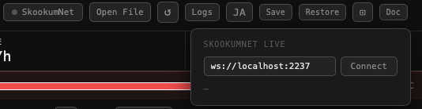

1. Click the **SkookumNet** button (top right) to open the panel.
2. Confirm the WebSocket URL (default: `ws://localhost:2237`).
3. Click **Connect**.

On successful connection:
- A **LIVE** badge lights up in the header.
- A **Pane** opens automatically.
- The chart updates in real time as QSOs come in.

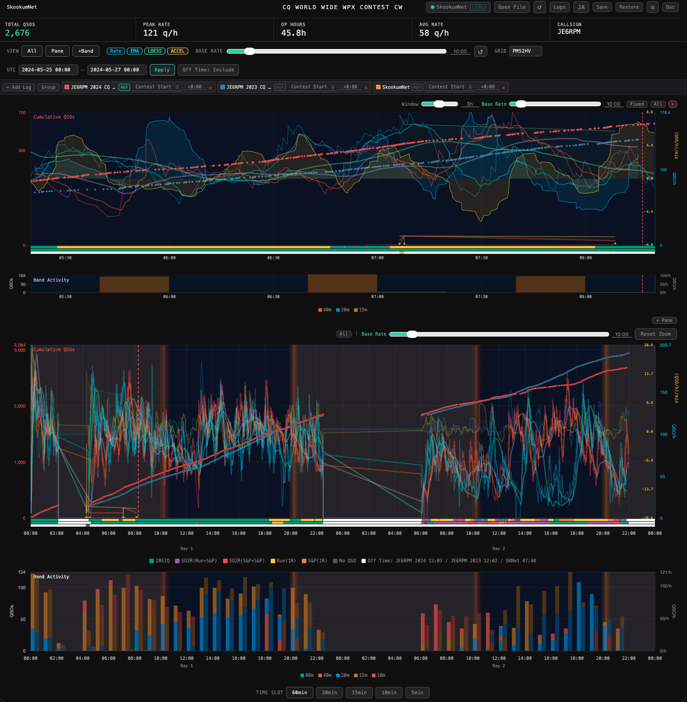

### After a browser reload

If you reload the browser while skookumnet-client is still running, simply reconnecting will re-receive all current QSOs — no need to restart skookumnet-client.

### Using alongside a historical log

You can load a historical Cabrillo or ADIF log while a SkookumNet live connection is active. Both the main chart and pane will overlay live and historical data simultaneously. The historical log becomes the reference log (X-axis anchor).

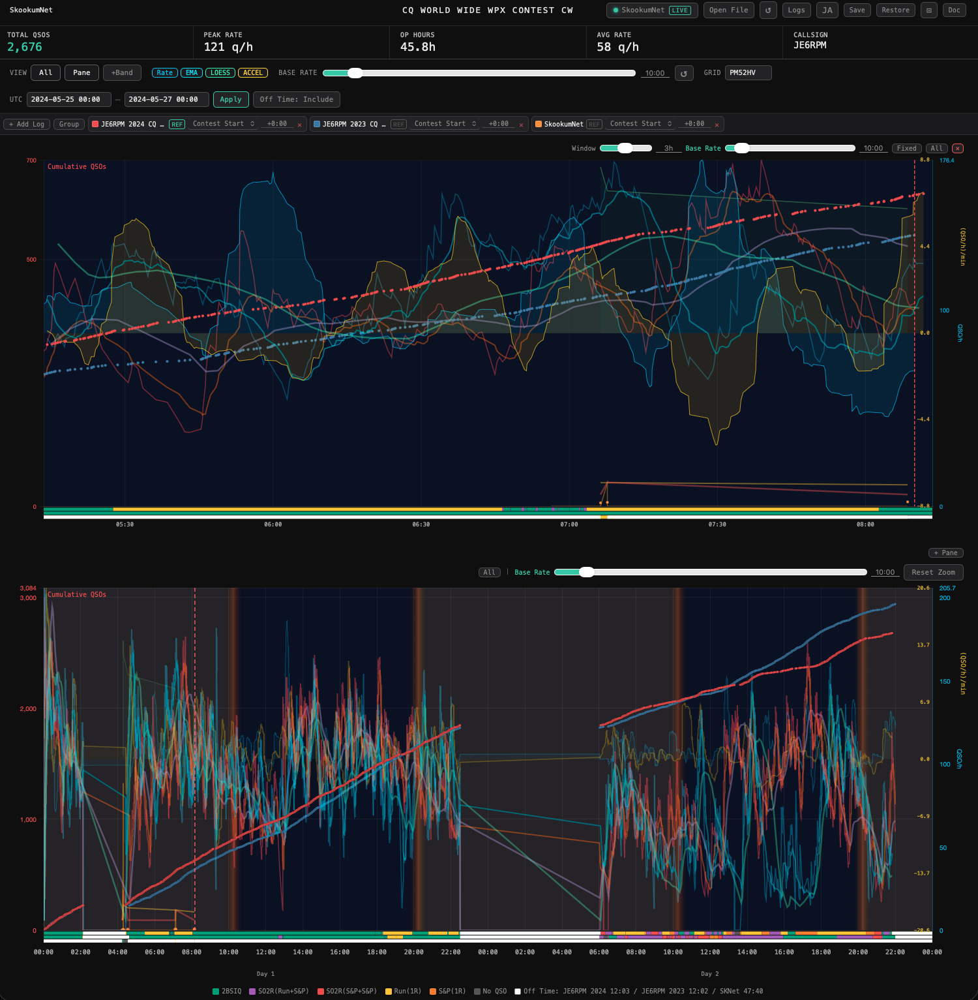

### Multi-station (multi-op)

When multiple PCs are in the same SkookumNet session, use the **All** button in any pane to select which station to display.

| Option | Displays |
|--------|---------|
| Combined | QSOs from all PCs merged |
| Individual callsign | QSOs from that PC only |

Multiple panes can be used simultaneously — one showing the combined total, others showing individual stations.

---

## 18. Save / Restore Session {#18-save--restore-session}

Save the currently loaded logs and settings to the browser, and restore them on next launch.

| Button | Function |
|--------|---------|
| **Save** | Save the current state to the browser's localStorage |
| **Restore** | Load the previously saved state |

What is saved:
- Loaded log filenames
- Base rate setting
- UTC range
- WebSocket URL
- Pane settings (time span, mode, displayed log, base rate)
- Trend settings (Rate / EMA / LOESS / ACCEL on/off)

> SkookumNet live data is not saved as a file and cannot be restored from localStorage — but reconnecting via SkookumNet will re-deliver all QSOs recorded since skookumnet-client started.

---

## 19. Grid Locator {#19-grid-locator}

Enter a grid locator (e.g., `PM52HV`) in the **Grid** field of the control bar to display sunrise/sunset information as a background tint on the pane and main chart. The tinted background indicates daylight hours; sunrise and sunset times are shown in a deeper orange.

- **Manual entry takes priority.** If the loaded log (ADIF) contains grid information, manual entry overrides it.
- If the Grid field is empty, grid information from the log is used automatically.
- Manual entry is preserved when the log is reloaded.

---

## 20. Language {#20-language}

Use the **EN** / **JA** button (top right) to switch between English and Japanese.

- If your browser's language is set to Japanese, the interface defaults to Japanese.
- Otherwise, it defaults to English.

---

## 21. Zoom and Pan {#21-zoom-and-pan}

Both the main chart and panes support zoom and pan.

| Action | Function |
|--------|---------|
| Drag within the chart area (left-click + move) | Zoom in (expands selected range) |
| Drag along the time labels at the chart bottom (left-click + move) | Pan the chart left or right |
| **Reset zoom** button | Reset zoom entirely and return to the original scale |

---

## 22. Troubleshooting {#22-troubleshooting}

### Chart does not appear
- Verify that `chart.min.js` is in the same folder as `contest_log_analyzer.html`.
- Open the browser console (F12 → Console tab) and check for error messages.

### Cannot connect to SkookumNet
- Is skookumnet-client running?
- Is SkookumLogger running?
- Is a firewall or security software blocking port 2237?
- Is the WebSocket URL set to `ws://localhost:2237`?

### File will not load
- Is the file in Cabrillo or ADIF format?
- Is the file encoded in UTF-8 or ASCII?

### Off Time button does not appear
- Off Time detection only applies to Cabrillo / ADIF files whose contest name contains **WPX** or **WAE (Worked All Europe)**.
- Entering start and end times in the UTC field and clicking **Apply** will cause any out-of-range periods to also be detected as Off Time.
- When a SkookumNet connection is active, the contest name reported by SkookumNet is also used for detection.

### Log times are misaligned in multi-log mode
- Check the anchor (time reference point) setting in the log management panel.
- If both logs are from the same contest, "Contest Start" is the standard anchor.
- When comparing logs from different contest years or dates, "First QSO" is often easier to align with.

---

## 23. Using on a Smartphone {#23-using-on-a-smartphone}

Works on iPhone (Safari) and other mobile browsers. Both portrait and landscape orientations are supported. The Compact mode (⊡ button) reduces on-screen clutter and is recommended for small screens.

### Hide / Show button

When the Pane View is active, a **▲ Hide** button appears at the bottom-left of the screen. Tapping it hides the header, stats bar, and controls, giving the panes more vertical space. The **▼ Show** button appears in the same position and restores the hidden elements.

<div class="screenshot-pair">
<figure>
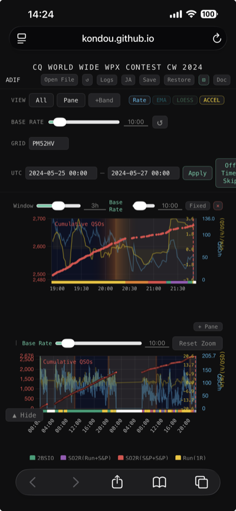
<figcaption>▲ Hide: header and controls visible</figcaption>
</figure>
<figure>
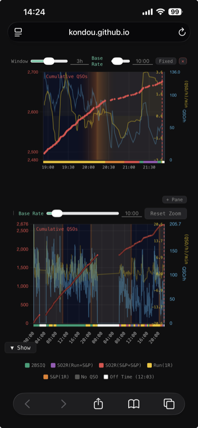
<figcaption>▼ Show: header and controls hidden, panes maximised</figcaption>
</figure>
</div>

| Button | Action |
|--------|--------|
| **▲ Hide** | Hide header and controls, maximise pane area |
| **▼ Show** | Restore header and controls |

> This button appears only while the Pane View is active. It works in both portrait and landscape orientations.

---

## License

BICHOK version 1.0.0  
Copyright © 2026 kondou  
Released under the MIT License.

```
Permission is hereby granted, free of charge, to any person obtaining a copy
of this software and associated documentation files (the "Software"), to deal
in the Software without restriction, including without limitation the rights
to use, copy, modify, merge, publish, distribute, sublicense, and/or sell
copies of the Software, and to permit persons to whom the Software is
furnished to do so, subject to the following conditions:

The above copyright notice and this permission notice shall be included in all
copies or substantial portions of the Software.

THE SOFTWARE IS PROVIDED "AS IS", WITHOUT WARRANTY OF ANY KIND, EXPRESS OR
IMPLIED, INCLUDING BUT NOT LIMITED TO THE WARRANTIES OF MERCHANTABILITY,
FITNESS FOR A PARTICULAR PURPOSE AND NONINFRINGEMENT. IN NO EVENT SHALL THE
AUTHORS OR COPYRIGHT HOLDERS BE LIABLE FOR ANY CLAIM, DAMAGES OR OTHER
LIABILITY, WHETHER IN AN ACTION OF CONTRACT, TORT OR OTHERWISE, ARISING FROM,
OUT OF OR IN CONNECTION WITH THE SOFTWARE OR THE USE OR OTHER DEALINGS IN THE
SOFTWARE.
```
