# BICHOK — 利用ガイド

コンテストログ（Cabrillo / ADIF）をブラウザで可視化・分析するためのツール。
SkookumLogger / SkookumNet とリアルタイム連携することも可能。
読み方はビックホック(bikhɔ́k)、Butt In Chair, Hands On Keyboardの略。

---

## 目次

1. [用語集](#1-用語集)
2. [起動と基本操作](#2-起動と基本操作)
3. [ログ読み込み](#3-ログ読み込み)
4. [画面構成の概要](#4-画面構成の概要)
5. [統計バー](#5-統計バー)
6. [表示モードの切り替え](#6-表示モードの切り替え)
7. [全体グラフの見方](#7-全体グラフの見方)
8. [バンド別グラフ](#8-バンド別グラフ)
9. [運用モードカラー](#9-運用モードカラー)
10. [トレンド表示（Rate / EMA / LOESS / ACCEL）](#10-トレンド表示rate--ema--loess--accel)
11. [ベースレート](#11-ベースレート)
12. [UTC 範囲指定とコンテスト開始・終了](#12-utc-範囲指定とコンテスト開始終了)
13. [Off Time スキップ](#13-off-time-スキップ)
14. [シミュレーション再生](#14-シミュレーション再生)
15. [複数ログの読み込み](#15-複数ログの読み込み)
16. [ペインビュー（ローリングウィンドウ）](#16-ペインビューローリングウィンドウ)
17. [SkookumNet ライブ接続](#17-skookumnet-ライブ接続)
18. [セッションの保存・復元](#18-セッションの保存復元)
19. [グリッドロケーター](#19-グリッドロケーター)
20. [表示言語の切り替え](#20-表示言語の切り替え)
21. [ズームとパン](#21-ズームとパン)
22. [トラブルシューティング](#22-トラブルシューティング)

---

## 1. 用語集 {#1-用語集}

このドキュメントで使用する主な用語を説明する。各セクションの説明時に適宜参照を。

### コンテスト運用形態

| 用語 | 説明 |
|------|------|
| **Run / CQ** | CQ を出して相手局を呼ばせる運用。グラフの凡例では "Run" と表示 |
| **S&P（Search & Pounce）** | いわゆる呼びまわり運用。グラフの凡例では "S&P" と表示 |
| **1R（1 Radio）** | 1 台のリグでの運用 |
| **SO2R（Single Operator 2 Radio）** | 1人のオペレーターが2台のリグを同時に使用する運用 |
| **2BSIQ（Two Bands Synchronized Interleaved QSOs）** | SO2R の手法の一つ。2つのバンドで同時に Run による QSO を行う運用 |

> **自動判定について**
>
> Cabrillo / ADIF ログでは、QSO ごとの送信周波数の変化量からバンドごとに Run / S&P を自動推定する。
>
> **推定ルール（バンドごとに適用）:**
>
> 1. 同バンド内の連続する QSO 間の周波数変化を計算
> 2. 0.5 kHz 以上の変化が30分以内に2回以上連続した場合 → **S&P**
> 3. 確定した **S&P** を起点に、隣接する QSO が同様に周波数変化があれば順次 **S&P** とする（30分を超える無 QSO 状態で判定は終了）
> 4. **S&P** 以外の QSO はすべて **Run** とみなす
>
> **判定基準:** **Run** 時は同一周波数で CQ を出すため周波数変化が小さいと仮定。**S&P** は異なる局を順次呼ぶため周波数変化がある。
>
> **判定が外れやすいケース:** 周波数を移動しつつ **Run**、QSO 毎の周波数遷移が非常に小さい **S&P**、あるいは kHz 未満の情報を持たない Cabrillo ログでは誤判定が生じることがある。マルチオペのログではリグが複数台あることも多く、正しく判定できない可能性が高い。
>
> **周波数データが記録されていない場合:** リグコントロール無しの状態でログされている場合、ログ上の周波数が固定または (**kHz** の3桁が **000**)となる。この場合、QSO 間の周波数変化が **0** と計算され、すべて **Run** と判定される。運用モードカラー表示が実態と異なる場合はログの周波数を要確認。
>
> ADIF あるいは SkookumNet ライブ接続時は Cabrillo（分単位）より高精度な時刻（ADIF なら秒、SkookumNet の場合はミリ秒）と周波数（Hz 単位）が得られるため、より精度よく推定可能。

### ログフォーマット

| 用語 | 説明 |
|------|------|
| **Cabrillo** | コンテストで使用するログの標準フォーマット。拡張子 `.log` `.cbr` `.txt` `.cabrillo` |
| **ADIF（Amateur Data Interchange Format）** | コンテストに限らず各種ロギングソフトで広く使われるログフォーマット。Cabrillo では各 QSO の時間表現が分単位、そして記録される周波数単位が kHz だが、ADIF では秒単位、そして Hz 単位であるため、より詳細な分析には有意。拡張子 `.adi` `.adif` |

### 時間・レート関連

| 用語 | 説明 |
|------|------|
| **QSO/h レート** | 1時間あたりの QSO 数。コンテストの運用状態を示す指標の一つ。Cabrillo ログでは QSO 時刻が分単位のため、同一分内に複数の QSO が記録されている場合、その秒位置は不明となる。このツールでは同一分内の QSO を 60 秒間に等間隔で分布したものと仮定して秒を補完し、レート計算に使用する。 |
| **ベースレート** | レートを算出する際の集計時間幅。例: 10分なら「直近10分間のQSO数×6」で QSO/h を算出 |
| **No QSO** | 10分以上の無 QSO 状態。運用モードカラーにグレーで表示され、凡例に "No QSO" と表記。バンドチェンジや機器操作等を含め QSO が無い状態を示す。WPX・WAE コンテストでは空白が60分未満の場合は No QSO、60分以上になると Off Time に切り替わる。それ以外のコンテストでは空白の長さによらずすべて No QSO として扱われる |
| **Off Time** | WPX・WAE コンテストのシングルOP部門で求められる QSO 休止時間。連続する無 QSO 状態が60分以上の区間。運用モードカラーに白で表示される。レート計算から除外可能 → [Off Time スキップ](#13-off-time-スキップ) 参照 |

### トレンド曲線

| 用語 | 説明 |
|------|------|
| **Rate** | 各時点での QSO/h レートの値。指定した時間あたりの QSO 密度を示す。遡る時間が短いと QSO の間隔のばらつきによっては上下に大きく振れることがある |
| **EMA（Exponential Moving Average / 指数移動平均）** | Rate のノイズを除去しつつ直近の変化に敏感な平滑化曲線（単位: QSO/h）。「今のレートが上昇傾向か下降傾向か」をリアルタイムで把握するのに向く。算出式: `新EMA = α × 現在のQSO/hレート + (1−α) × 直前EMA`（α = 2 ÷ (ベースレート[分] + 1)） |
| **LOESS（Locally Estimated Scatterplot Smoothing / 局所回帰）** | コンテスト全体を俯瞰するための極めてなめらかなトレンド曲線（単位: QSO/h）。EMA より変化への反応は遅いが、「何時台がピークだったか」「深夜帯の落ち込みはどの程度だったか」といったマクロな運用パターンの把握に向く。未来データを参照しない実装。各時点について、過去の Rate 値を使い時間的に近い点ほど大きく、遠い点ほど小さく重み付けした局所線形回帰で算出する |
| **ACCEL（加速度）** | EMA の変化速度（単位: (QSO/h)/min）。Rate は瞬間的な変動が大きいため、平滑化済みの EMA を1分あたりの変化量に換算(微分)する。Rate や EMA の変化より一歩先に動くため、QSO 数加減状況変化の早期察知となり得る。正値 = レート上昇中、負値 = レート下降中 |

### 複数ログ比較

| 用語 | 説明 |
|------|------|
| **参照ログ（REF）** | 複数ログを比較する際の X 軸（時間軸）の基準となるログ |
| **コンテスト開始アンカー** | 複数ログの時刻を揃える際の基準点。"Contest Start"（コンテスト開始時刻）または "First QSO"（最初のQSO時刻）から選択 |
| **オフセット** | 各ログを時間軸上で意図的にずらす量。`+1:30` なら 1 時間 30 分後ろにシフト |

### SkookumLogger / SkookumNet

| 用語 | 説明 |
|------|------|
| **SkookumLogger** | macOS 向けコンテストロギングソフトウェア |
| **SkookumNet** | SkookumLogger 間で QSO 情報をリアルタイム共有するプロトコル。複数PCによる運用を想定 |
| **skookumnet-client** | SkookumNet パケットを受信し、このツール（ブラウザでアクセス）へ WebSocket で中継する Python スクリプト |

### その他

| 用語 | 説明 |
|------|------|
| **グリッドロケーター** | Maidenhead ロケーターシステムによる位置コード（例: `PM95`、`PM52HV`）。日照情報の計算に使用 |
| **localStorage** | ブラウザがデータを端末側に保存する仕組み。タブやウィンドウを閉じても保持される。保存場所はブラウザ依存。 |
| **運用モードカラー** | 全体グラフおよびペインのグラフ下部に表示される細い横帯。各色のセグメントが各時点の運用状態（Run / S&P / SO2R / No QSO / Off Time 等）を示す。色が切り替わる境界が運用状態の変化点にあたる。→ [運用モードカラー](#9-運用モードカラー) |
| **ペイン** | 直近 N 時間のQSOを拡大表示するローリングウィンドウ (時間経過によってグラフあるいは現時刻線が移動する) のサブチャート。複数配置可能 |

---

## 2. 起動と基本操作 {#2-起動と基本操作}

`contest_log_analyzer.html` をブラウザで開いて利用する。インターネット接続・インストール・サーバーは不要（SkookumNet 連携時には他の SkookumLogger と同じ L2 ネットワークへの接続が必要）。

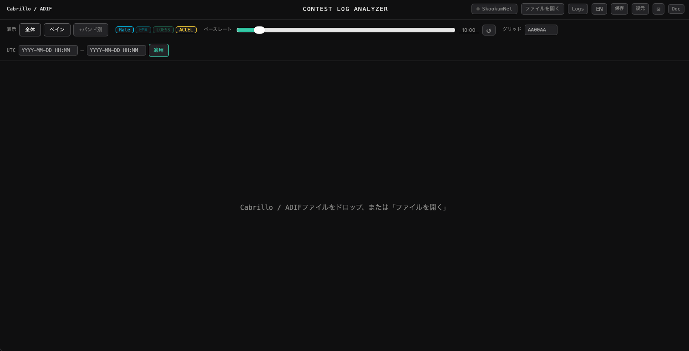

### 動作確認済みブラウザ
- Google Chrome / Chromium
- Safari
- Firefox
- Edge

### ファイル構成

**ログファイル分析のみ（SkookumNet なし）**
```
contest_log_analyzer.html   ← ブラウザで開くとツールが動作
chart.min.js                ← 同じフォルダに必要（グラフ描画ライブラリ）
```

**SkookumNet ライブ接続を使用する場合（macOS のみ）**
```
contest_log_analyzer.html
chart.min.js
skookumnet_client.py        ← SkookumNet ↔ ブラウザ中継スクリプト
start_skookumnet.command    ← ダブルクリックで起動するランチャー
plugins/                    ← skookumnet_client.py が使用するプラグイン群
```

SkookumNet ライブ接続の詳細な起動手順は → [§17 SkookumNet ライブ接続](#17-skookumnet-ライブ接続)

---

## 3. ログ読み込み {#3-ログ読み込み}

下記のいずれかの方法で読み込む、あるいは SkookumNet からのライブ接続(→[接続手順](#17-skookumnet-ライブ接続))。

### ドラッグ＆ドロップ
ブラウザウィンドウ上にファイルをドラッグ＆ドロップ。

### ファイルを開くボタン
右上の **「ファイルを開く」** ボタンをクリックしてファイルを選択。

### 対応形式

| 形式 | 拡張子 |
|------|--------|
| Cabrillo | `.log` `.cbr` `.txt` `.cabrillo` |
| ADIF | `.adi` `.adif` |

### 2つ目以降のログを読み込む
すでにログが表示されている状態で新しいファイルを開くと、確認ダイアログが表示される。

| 選択 | 動作 |
|------|------|
| **OK** | 比較用ログとして追加（→ [複数ログの読み込み](#15-複数ログの読み込み)） |
| **Cancel** | 現在のログを置き換えて新規に読み込む |

### 読み込み後の表示

Cabrillo / ADIF ファイルにコンテスト名が含まれる場合、読み込み後にヘッダーへコンテスト名が自動表示される。SkookumNet でも受け取ったデータにコンテスト名が含まれていれば同様に自動表示される。

### ↺ ボタン（再読み込み）
右上に表示される **↺** ボタンで、最後に読み込んだファイルを再度読み込む。該当ファイルを更新した後等に使用。

---

## 4. 画面構成の概要 {#4-画面構成の概要}

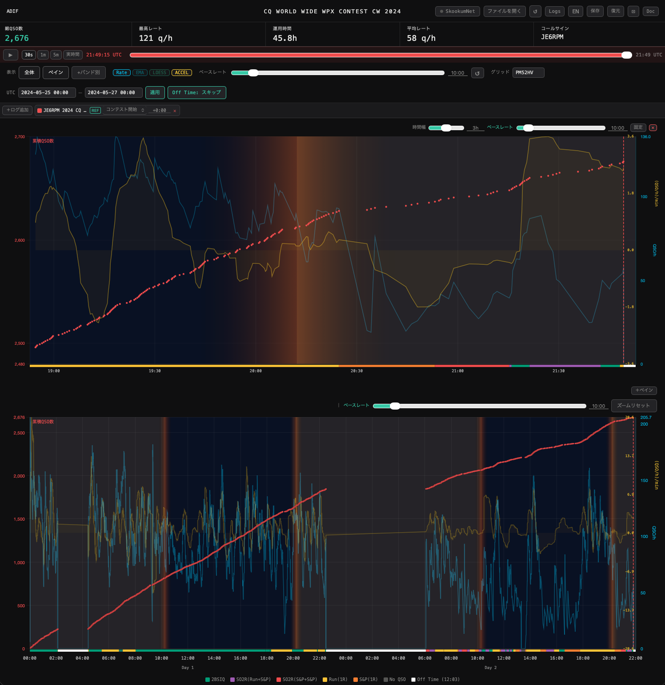

画面は上から下に以下の構成となる。

| エリア | 説明 |
|--------|------|
| ヘッダー | ファイルを開く・↺・Logs・言語切替・保存/復元・⊡（コンパクト）・Doc など各種ボタン群・コンテスト名称・ファイルフォーマット(ログ読み込み後に確定したものを表示) |
| 統計バー | 総QSO数・最高レート・運用時間・平均レート・コールサイン（ログ読み込み後に表示） |
| シミュレーションバー | 再生・一時停止・速度・スライダー（ログ読み込み後に表示） |
| コントロールバー | 表示モード切替・トレンド表示切替・ベースレート設定・グリッドロケーター・UTC範囲指定・ログ管理パネル |
| ペイン | **ペイン** ON 時に追加されるローリングウィンドウ |
| 全体グラフ | 累積QSO（左軸）とレート（右軸）を時系列表示。下部に運用モードカラー |
| バンド別グラフ | **+バンド別** ON 時に全体グラフ下に表示。ペインが表示されていればペインの下にも表示 |

---

## 5. 統計バー {#5-統計バー}

ログ読み込み後、画面上部に主要統計が表示される。

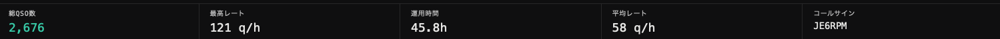

| 表示 | 内容 |
|------|------|
| 総QSO数 | ログ内のQSO件数合計 |
| 最高レート | ピーク時の QSO/h（[ベースレート](#11-ベースレート)の設定に依存） |
| 運用時間 | 最初〜最後のQSO間の時間 |
| 平均レート | 総QSO ÷ 運用時間 |
| コールサイン | ログから読み取った自局コールサイン |

### コンパクトモード

右上の **⊡** ボタンをクリックすると統計バー・シミュレーションバー・ログパネルが非表示になり、グラフ表示エリアを広く使えるようになる。ブラウザの画面高が限られているときや、ライブ運用中にグラフを大きく表示したい場合に有用。再度クリックすると元の表示に戻る。

### Doc ボタン

右上の **Doc** ボタンをクリックすると、新しいタブでこのマニュアルを開く。表示言語（日本語／英語）に合わせて対応するマニュアルが開く。

---

## 6. 表示モードの切り替え {#6-表示モードの切り替え}

コントロールバー左端の **表示** グループで切り替える。

| ボタン | 動作 |
|--------|------|
| **全体** | 全体の累積QSOグラフを表示 |
| **ペイン** | ローリングウィンドウとなるグラフを追加表示 |
| **+バンド別** | バンド別の QSO 分布グラフを追加表示（ペインと全体グラフの下） |

> **全体とペインは同時使用可:** 上段にペイン、下段に全体グラフが表示される。

---

## 7. 全体グラフの見方 {#7-全体グラフの見方}

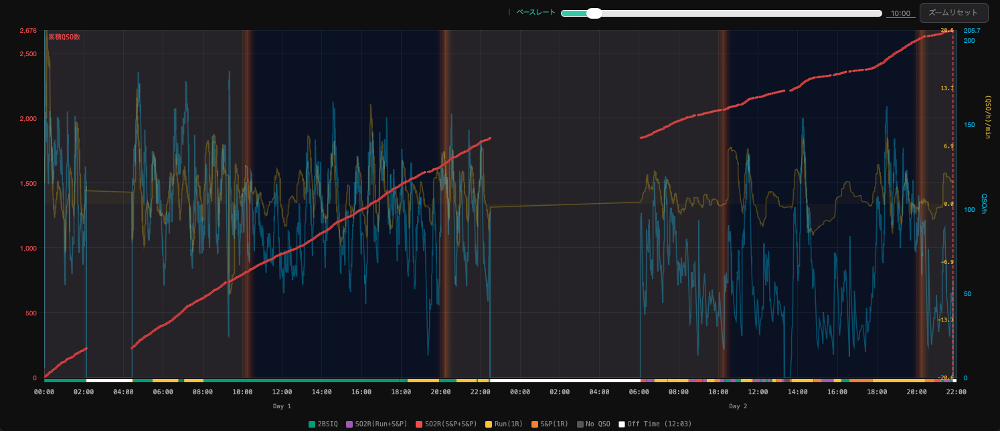

グラフはいくつかの情報を重ねた表示となる。

| 要素 | 軸 | 色 | 内容 |
|------|----|----|------|
| 累積QSO | 左軸（赤） | 赤 | ログ開始からの累積 QSO 数。QSO の密度を一瞥可能とするためこのグラフのみ各 QSO 毎にドット(・)での描画とし、ドット間を線で結んでいない |
| ACCEL以外の各種レート | 右軸（水色） | 水色および各種レートの色に準じる | [ベースレート](#11-ベースレート)で算出した QSO/h |
| ACCEL | 右軸（黄色、上記とは別目盛り） | 黄色 | [ベースレート](#11-ベースレート)で算出したレートの加速度 (QSO/h)/min |
| 運用モードカラー | グラフ下部 | 各色 | 各時点の運用状態（→ [運用モードカラー](#9-運用モードカラー)） |

### グラフ上のマーカー

- **日の出・日の入り（黄・オレンジの縦線）:** グリッドロケーターが設定されている場合に表示。→ [グリッドロケーター](#19-グリッドロケーター)
- **赤い破線:** ペインあるいは全体グラフでの現在時刻マーカー

### ツールチップ

ツールチップとは、グラフ上にマウスカーソルを乗せたときに自動で現れる小さな情報ポップアップのこと。全体グラフではカーソル位置の時刻に対応する以下の値が表示される。

| 項目 | 内容 |
|------|------|
| HH:MM:SS UTC | カーソル位置の UTC 時刻 |
| 累積 N QSO | その時点までの累積 QSO 数 |
| Rate: N.N | その時点の QSO/h レート |
| EMA: N.N | EMA 値（EMA がオンの場合） |
| LOESS: N.N | LOESS 値（LOESS がオンの場合） |
| ACCEL: N.NN | ACCEL 値（ACCEL がオンの場合） |

複数ログ比較時は各ログの値がログ名付きで1行ずつ表示される。

---

## 8. バンド別グラフ {#8-バンド別グラフ}

**+バンド別** ボタンをオンにすると、全体グラフの下（およびペインの下）にバンドごとの棒グラフが表示される。棒グラフを表示させると画面最下部に集計幅を切り替えるボタンが表示される。いずれかのボタンをクリックすることで集計幅を切り替える。

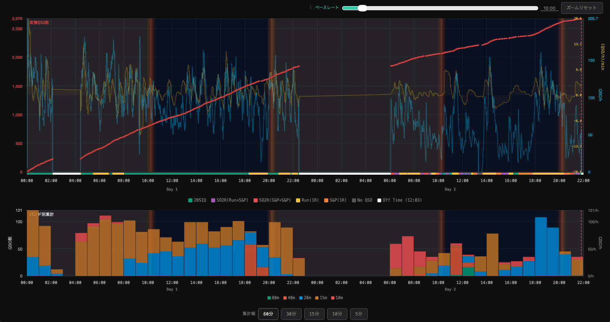

### 表示内容

各棒グラフは集計幅ごとに、その時間内での各バンドのレート (QSO/h) を示す棒グラフの高さであり、集計幅あたりの QSO 数ではないことに注意。なお、集計幅が 60 分の場合、1 時間あたりの QSO 数としても参照可能。

### バンドカラーと凡例

バンド別グラフ下部の凡例にはバンド名と対応する色を表示。グラフに現れたバンドのみ凡例として表示。複数ログを比較している場合、いずれかのログに出現したバンドが凡例に表示。

複数ログ比較時は、各スロットの棒が参照ログ（REF）と追加ログがそれぞれ並べて表示される（→ [複数ログの読み込み](#15-複数ログの読み込み)）。視覚的な区別を容易にするため、**追加ログの棒グラフは参照ログの棒グラフより色が暗く（暗色化）・やや透明**になっている。

### ツールチップ

バンド別グラフにマウスカーソルを乗せると、そのスロットの詳細がツールチップに表示される。

| 項目 | 内容 |
|------|------|
| HH:MM〜HH:MM UTC | スロットの開始〜終了時刻 |
| バンド名: N QSO / N/h | 各バンドの QSO 数とレート（バンドカラーのドット付き） |
| 合計: N QSO / N/h | スロット全体の合計 |

複数ログ比較時はログ名がスロット時刻の前に表示される。

### ペインのバンド別グラフ

ペイン表示時に **+バンド別** をクリックするとペイン下部にも同様の棒グラフが表示される。

---

## 9. 運用モードカラー {#9-運用モードカラー}

全体グラフおよびペインの **グラフ下部に表示される細い横帯**（運用モードカラー）は各時点の運用状態を色で表す。帯は時間軸と連動。グラフ下部の凡例には各種状態のラベルと、WPX・WAE コンテスト時は Off Time の累計時間が表示される。

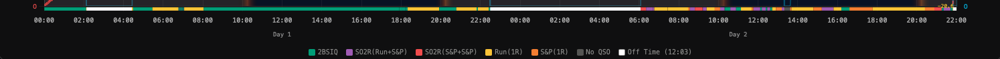

| 色 | ラベル | 意味 |
|----|--------|------|
| 緑 | Run(1R) | 1R で Run による運用 |
| オレンジ | S&P(1R) | 1R で S&P による運用 |
| 黄緑 | 2BSIQ | SO2R で同時 Run 運用（2BSIQ） |
| 紫 | SO2R(Run+S&P) | SO2R で一方が Run・他方が S&P 運用 |
| 赤 | SO2R(S&P+S&P) | SO2R で二つのバンドでの S&P 運用 |
| グレー | No QSO | 10分以上の無 QSO 状態 |
| 白 | Off Time | 60分以上の休止（無 QSO）状態。WPX・WAE のみ |

> WPX・WAE 以外のコンテストでは、60分以上の空白も「No QSO」として表示される（Off Time 判定はしない）。

---

## 10. トレンド表示（Rate / EMA / LOESS / ACCEL） {#10-トレンド表示rate--ema--loess--accel}

全体グラフに重ねて表示するトレンド曲線。各ボタンをクリックし、表示 / 非表示を切り替える。

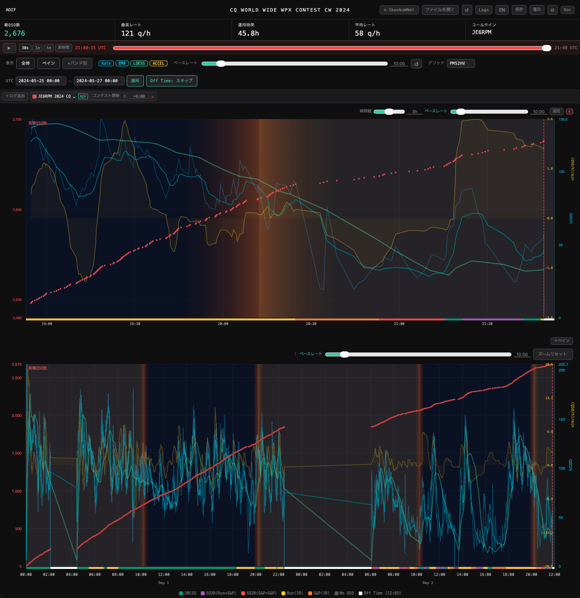

| ボタン | 色 | 用途 |
|--------|----|------|
| **Rate** | 水色 | [ベースレート](#11-ベースレート)で指定した時間幅での QSO レート |
| **EMA** | シアン | Rate のノイズを除いた短期トレンド |
| **LOESS** | 緑 | コンテスト全体のマクロなレート推移 |
| **ACCEL** | 黄 | レート変化の加速度。EMA よりも早くトレンドを示すことが多い |

### 複数ログ比較

複数ログの比較時、ログごとに異なる色が自動割り当てされる。参照ログ（REF）のトレンド線は青緑系の色で表示される。

---

## 11. ベースレート {#11-ベースレート}

QSO/h レートは、一定の時間幅（ベースレート）を使って算出。


**ベースレート** の入力欄による集計時間幅を変更。

- 範囲: 1秒〜120分
- 入力形式: `MM:SS`（例: `10:00` = 10分、`0:30` = 30秒）
- **↺** ボタンで 10 分（デフォルト）に戻る

> **例:** ベースレートが 10 分の場合、ある時点での Rate 値 = 直近 10 分間の QSO 数 × 6 で計算される。

ペイン毎にベースレート指定可能（→ [ペインビュー](#16-ペインビューローリングウィンドウ)）。

---

## 12. UTC 範囲指定とコンテスト開始・終了 {#12-utc-範囲指定とコンテスト開始終了}

コンテスト開始・終了時刻を手動で指定する場合はコントロールバー右側の **UTC** 欄を使用する。

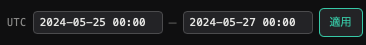

```
YYYY-MM-DD HH:MM 形式（例: 2024-05-25 00:00）
```

| 操作 | 効果 |
|------|------|
| 入力後 **適用** | グラフの表示範囲を指定した時間に設定。[Off Time](#13-off-time-スキップ) の境界検出も UTC 範囲に準じる |
| **✕** ボタン | 範囲指定を解除 |

### 複数ログ比較時のアンカーとオフセット

ログ管理パネル（→ [複数ログの読み込み](#15-複数ログの読み込み)）では、各ログの時刻基準点（コンテスト開始アンカー）とオフセットを指定可能。

| アンカー | 基準点 |
|----------|--------|
| Contest Start | UTC 欄の開始時刻を基準に時刻を合わせる |
| First QSO | そのログの最初のQSO時刻を基準に時刻を合わせる |

---

## 13. Off Time スキップ {#13-off-time-スキップ}

WPX・WAE コンテストのログで Off Time が検出されると、コントロールバーに **Off Time: スキップ** ボタンが表示される。


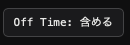

ボタンのラベルで現在の状態を示す。

| ボタン表示 | 状態 | 動作 |
|-----------|------|------|
| **Off Time: スキップ**（アクセントカラー） | ON（スキップ中） | Off Time 区間をレート計算から除外。実際の運用時間のみでレートを算出 |
| **Off Time: 含める** | OFF（スキップしていない） | Off Time を含めてレートを計算 |

クリックするたびに ON / OFF が切り替わる。

> 凡例の「Off Time (HH:MM)」に表示される時間は、Off Timeスキップの ON/OFF に関わらず常に Off Time の合計時間となる。

---

## 14. シミュレーション再生 {#14-シミュレーション再生}

ログ読み込み後、統計バーの下に **シミュレーションバー** が表示される。ログを時間軸に沿って再生し、ライブ接続と同様に時間の経過による累積 QSO 数やレート関連値を表示。バンド別グラフを表示している場合、棒グラフへの積み上げ状況も再生される。SkookumNet ライブ接続がある場合には **シミュレーションバー** は表示されない。

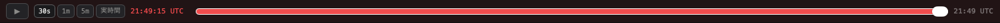

| 操作 | 内容 |
|------|------|
| ▶ / ❚❚ | 再生・一時停止 |
| スライダー | 任意の時点にジャンプ |
| **30s / 1m / 5m** | 壁時計 30秒・1分・5分で全体を再生（高速再生） |
| **実時間** | 実際の経過時間で再生 |

再生中は全体グラフとペインが再生時間に応じて更新される。

---

## 15. 複数ログの読み込み {#15-複数ログの読み込み}

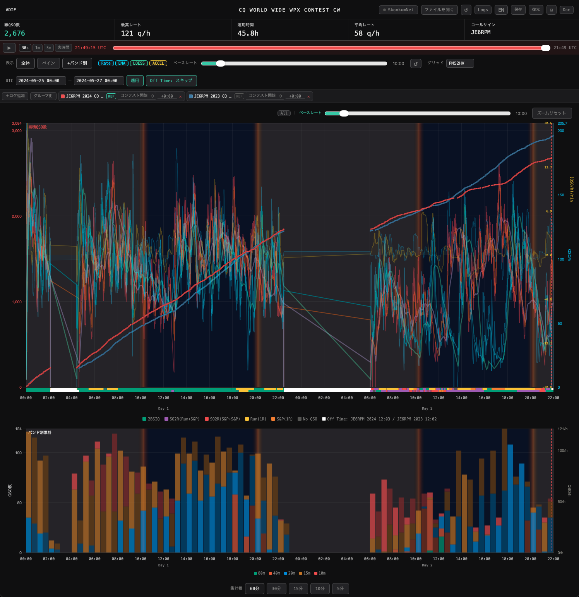

### ログの追加方法

1. **Logs** ボタン → ログ管理パネルを開く
2. **＋ログ追加** → ファイルを選択
3. またはドラッグ＆ドロップで追加（「OK（追加）」を選択）

### ログ管理パネル

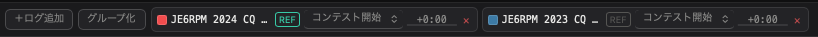

| 操作 | 内容 |
|------|------|
| カラースウォッチ（■）クリック | そのログの表示・非表示を切り替え |
| ラベルをダブルクリック | ログの表示名を編集 |
| **REF** ボタン | このログを X 軸（時間軸）の基準（参照ログ）に指定 |
| アンカー選択 | Contest Start / First QSO から選択 |
| offset 欄 | 時間オフセットを指定（例: `+1:30` = 1時間30分後ろにシフト） |
| **✕** ボタン | グラフからこのログの情報を全て削除 |

### グループ化

二つ以上のログを読み込んだ状態で **グループ化** ボタンをクリックすると、全QSOを合算した仮想ログが新たに追加される。通常のログと同様に表示・操作が可能。

- **Ungroup** ボタンで解除（元のログはそのまま残る）
- SkookumNet で複数の局（SO2R など）のデータを受信している場合に合算表示等が可能

### 全体グラフの表示ログ絞り込み

全体グラフ右上の **All** ボタンをクリックするとドロップダウンが開き、全体グラフに表示するログを絞り込める。

---

## 16. ペインビュー（ローリングウィンドウ） {#16-ペインビューローリングウィンドウ}

**ペイン** ボタンをクリックすると、直近 N 時間のQSOを拡大表示するペインが追加される。SkookumNet ライブ接続時のリアルタイム表示に有用。

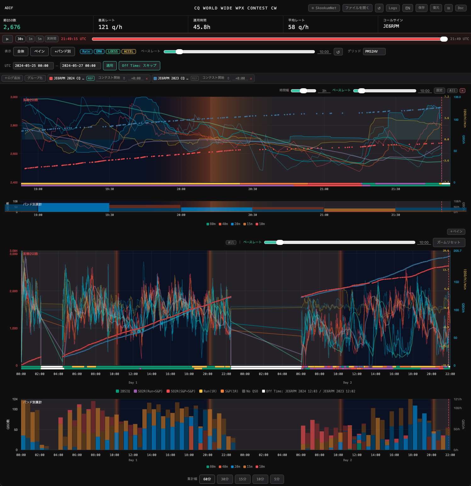

### ペインの操作

| 操作 | 内容 |
|------|------|
| **Window** スライダー | 表示する時間幅を変更（5分〜6時間） |
| **ベースレート** 入力欄 | ペインのレート集計時間幅を変更（画面上部のベースレートを変更すると、ペインのベースレートも連動して上書きされる。ペイン個別の値を維持したい場合は、全体のベースレートを変更した後にペインのベースレートを再設定すること） |
| **固定 / 追随** ボタン | 表示モードを切り替え（→ [固定モードと追随モード](#固定モードと追随モード)） |
| **＋ペイン** ボタン | 新たにペインを追加（複数表示となる） |
| **✕** ボタン | 表示中のペインを閉じる |
| **All** ボタン | ペインに表示するログ・PCを選択 |
| **ズームリセット** ボタン | ズームを解除 |

### 固定モードと追随モード

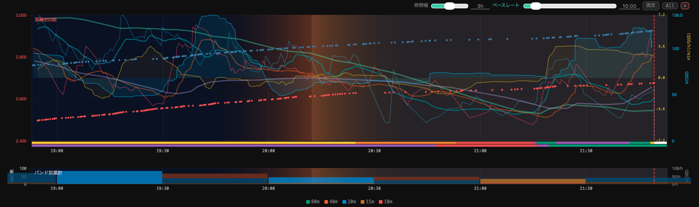

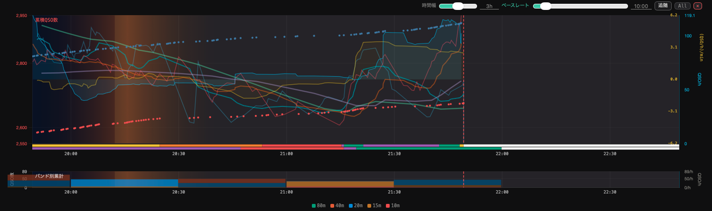

| モード | 動作 |
|--------|------|
| **固定** | 赤い破線（現在時刻マーカー）の位置はグラフ上で固定され動かない。時刻の経過とともにグラフ全体が右から左へスクロールする |
| **追随** | グラフ位置は固定。赤い破線（現在時刻マーカー）が時間経過とともに左から右へグラフ上を移動する。破線がグラフ右端から 2% の位置に達すると、グラフ全体が左にシフトし、シフト直後の破線位置はグラフ右端から 1/3 の地点に再配置される |

### ペインのズームとパン

グラフエリア内をドラッグして範囲を選択するとズームインされる。グラフ下部の時刻表記部分をドラッグするとグラフ全体がパン（横移動）される。段階的なズームアウトはなく、**ズームリセット** ボタンで元の表示幅に一括リセットされる。

### 複数ペイン

**＋ペイン** ボタンで新たにペインを追加表示。例えば、一方のペインで全局合算の QSO 状況を、もう一方で特定の局だけ、のような表示も可能（→ [複数PC（マルチオペ）](#複数pcマルチオペ)）。

---

## 17. SkookumNet ライブ接続 {#17-skookumnet-ライブ接続}

SkookumLogger の SkookumNet パケットをリアルタイムで受信して表示。

### 前提条件

- macOS 上で skookumnet-client が起動していること
- SkookumLogger が起動していること

> **SkookumNet ボタンについて:** macOS 以外の環境ではボタンは表示されない。macOS であればボタンは表示されるが、skookumnet-client が未起動の状態で接続を試みた場合は接続エラーとなる。

```bash
# skookumnet-client の起動（start_skookumnet.command をダブルクリックでも可）
uv run python skookumnet_client.py
```

### 接続手順

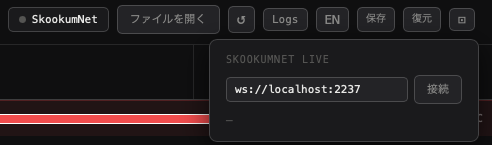

1. 右上の **SkookumNet** ボタンをクリックしてパネルを開く
2. WebSocket URL を確認（デフォルト: `ws://localhost:2237`）
3. **接続** ボタンをクリック

接続が成功すると:
- ヘッダーに **LIVE** バッジが点灯する
- **ペイン** が自動的に開く
- QSO 情報を受けるごとにグラフがリアルタイム更新される

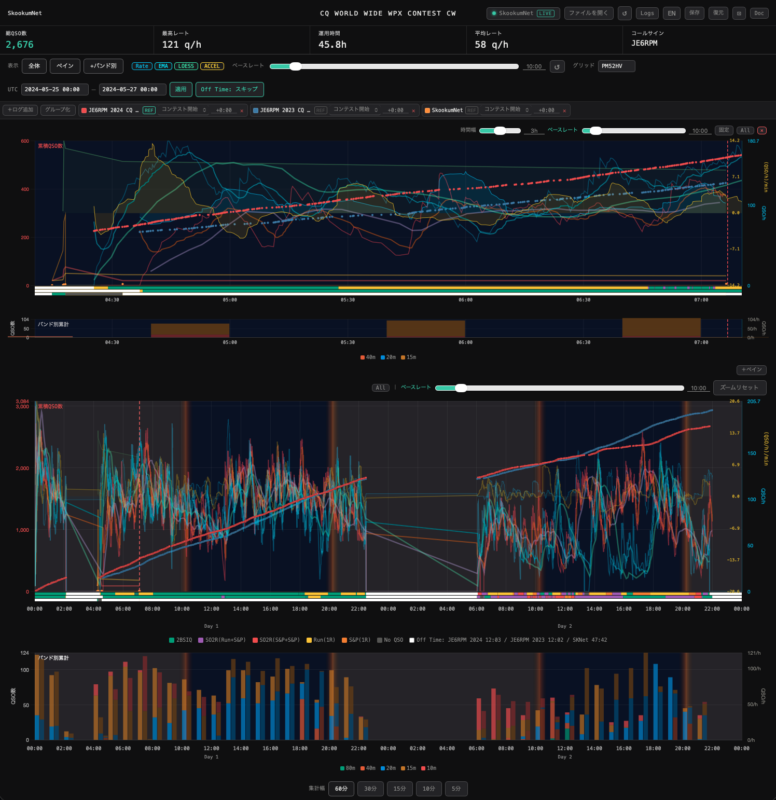

### ブラウザをリロードした場合

ブラウザをリロードしても、skookumnet-client が起動したままであれば接続を再開するだけで現在のすべての QSO の情報が再び取り込まれる。skookumnet-client の再起動は不要。

### 過去ログとの併用

SkookumNet ライブ接続と同時に過去のコンテストの Cabrillo / ADIF ログを読み込むと、全体グラフ・ペインともにライブデータと過去データが重ねて表示される。過去ログは参照ログ（X 軸の基準）となる。

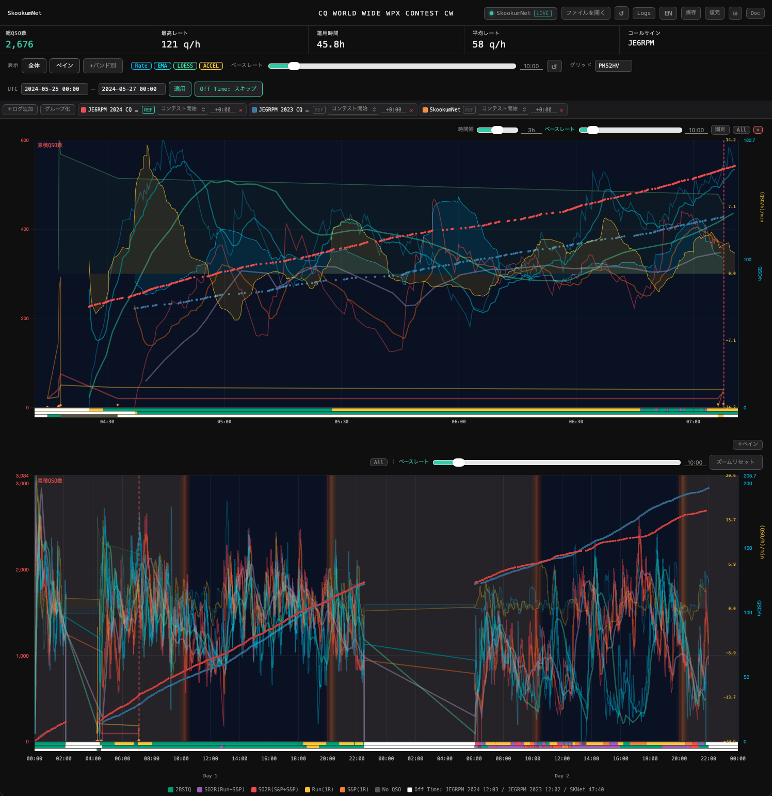

### 複数PC（マルチオペ）

同じ SkookumNet セッションに複数のPCが存在している場合、ペインの **All** ボタンから表示するPCを選択可能。

| 選択肢 | 表示内容 |
|--------|----------|
| 合算 | 全PCからのQSOを合算して表示 |
| 個別局名 | そのPCのQSOのみを表示 |

複数のペインを使い、一方は合算、他方は各PC別という表示も可能。

---

## 18. セッションの保存・復元 {#18-セッションの保存復元}

現在読み込んでいるログのファイル名等の情報と各種設定をブラウザに保存し、次回起動時に復元する。

| ボタン | 内容 |
|--------|------|
| **保存** | 現在の状態をブラウザの localStorage に保存 |
| **復元** | 保存した状態を読み込む |

保存される内容:
- 読み込んだログのファイル名
- ベースレート設定
- UTC 範囲
- WebSocket URL
- ペイン設定（時間幅・モード・表示ログ・ベースレート）
- 表示設定（Rate/EMA/LOESS/ACCEL のオン・オフ）

> SkookumNet ライブデータは保存されないため localStorage からは復元されないが、再接続することで skookumnet-client から全 QSO 情報を受け取る。

---

## 19. グリッドロケーター {#19-グリッドロケーター}

コントロールバーの **グリッド** 欄にグリッドロケーター（例: `PM52HV`）を入力すると、日の出・日の入り時刻をベースにペインや全体グラフの背景色として日照状態を表示。オレンジがかった背景色が日照時間帯。日の出と日の入り時刻は黄・オレンジの縦線にて表現。

- **グリッド欄への手動入力が最優先**。ログ（ADIF）にグリッド情報が含まれていても手動入力値で上書きされる
- グリッド欄が空の場合のみ、ログ内のグリッド情報を使用する
- ログを再読み込みしても手動入力値は保持される

---

## 20. 表示言語の切り替え {#20-表示言語の切り替え}

右上の **EN** / **JA** ボタンで日本語・英語を切り替える。

- ブラウザの言語設定が日本語の場合、デフォルトで日本語表示となる
- それ以外はデフォルトで英語表示となる

---

## 21. ズームとパン {#21-ズームとパン}

全体グラフ・ペインともにズームとパンが可能。

| 操作 | 内容 |
|------|------|
| ドラッグ（グラフエリア内を左クリック＋移動） | ズームイン（選択範囲に拡大） |
| ドラッグ（グラフ下部の時刻表記付近を左クリック＋移動） | パン（グラフを左右に移動） |
| **ズームリセット** ボタン | ズームを全解除して元の表示幅に戻す |

---

## 22. トラブルシューティング {#22-トラブルシューティング}

### グラフが表示されない
- `chart.min.js` が `contest_log_analyzer.html` と同じフォルダに存在しているか
- ブラウザのコンソール（F12 キー → Console タブ）でエラーに表示されている内容を確認

### SkookumNet に接続できない
- skookumnet-client が起動しているか
- SkookumLogger が起動しているか
- ファイアウォールやセキュリティソフトがポート 2237 をブロックしていないか
- WebSocket URL が `ws://localhost:2237` になっているか

### ファイルが読み込めない
- Cabrillo または ADIF 形式であるか
- 文字コードが UTF-8 または ASCII であるか

### Off Time ボタンが表示されない
- Off Time の自動検出は、コンテスト名に **WPX** または **WAE（Worked All Europe）** が含まれる Cabrillo / ADIF ファイルのみ対応
- コンテスト開始・終了時刻を UTC 欄に入力して **適用** すると、指定範囲外も Off Time として検出される
- SkookumNet 接続時は SkookumNet が返すコンテスト名も使用する

### 複数ログの時刻がずれる
- ログ管理パネルのアンカー（時刻基準点）設定を確認
- 両ログとも同じコンテストの場合は「Contest Start」アンカーが基本
- 異なるコンテスト年・日程の比較では「First QSO」アンカーが合わせやすい場合がある

